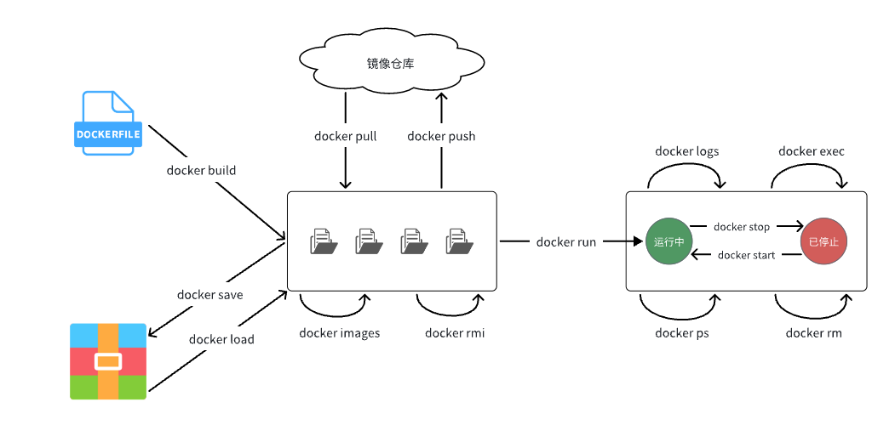

002.springcloud复习笔记
####################################

还得是 `黑马 <https://www.bilibili.com/video/BV1S142197x7/?spm_id_from=333.1007.top_right_bar_window_custom_collection.content.click&vd_source=3ae9dfcc16ba84113c717163327346c9>`_

0 概述 + 知识补习
==========================
微服务有很多问题：
什么是微服务，如何拆分
远程调用
服务治理
请求认证
配置管理
服务保护
分布式事务

将一个项目拆分成多个微服务，这样学起来才会真实的去解决问题

0.2 mybatisplus
---------------------
它并不是用来替代mybatis的，而是成为最佳合作伙伴，只是进行了增强。

1. 引入依赖
2. 自定义Mapper继承BaseMapper接口（注意这里要指定实体类的泛型）

.. warning::
    这里可以学习一下测试类的写法，之前写的不是很规范

常见注解：（现在都插件生成了，懂原理就行）
    默认是id为主键，变量、表明会自动转下划线
    可以使用@TableName @TableId @TableField 来指定各个玩意

    @TableId 
        主键有一个type的属性，支持auto,input,assign_id（雪花算法，生成Long）

        如果有类型自增长，需要指定auto

    @TableField必须场景
        - is开头的变量名映射到字段的时候会被去掉，所以一定要使用@TableField
        - 成员变量与数据库字段不同
        - 成员变量与数据库保留字冲突
        - 成员变量根本不是数据库字段
            - 添加@TableField(exist = false)

常见配置：

.. code-block::

    type-aliases-package 别名扫描包
    mapper-locations: mapper.xml文件地址
    configuration:
        map-underscore-camel-case: true 是否开启下划线和驼峰映射
        cache-enabled: false 是否开启二级缓存
    global-config:
        db-config:
            id-type: ossign_id
            update-strategy: not_null

条件构造器（Wraper）
    eq() ne() 等，可以实现较为复杂的curd

>>> 查询出名字中带o的，存款大于等于1k元的人的id, username, info, balance
>>> 
>>> new QueryWrapper<>()
                        .select("id", "username", "info", "balance")
                        .like("username", "o")
                        .ge("balance", 1000)
>>> userMapper.selectList(wrapper)

.. code-block::

    // 更新用户名为jack的用户的余额为2000
    User user = new User()
    user.setBalance(2000);

    new QueryWrapper<>().eq("username", "jack")

    userMapper.update(user,wrapper)

.. code-block::

    // 更加定制化的

    List<Long> idss = List.of(1,2,4L)

    new QueryWrapper<>().setSql("balance = balance-100")
                        .in("id", ids);

自定义SQL
    使用mp的wrapper构建where部分，剩下的我们自己写。
    像上边的扣款就是自定义，但是这样就涉及到一个问题，sql语句写进了service里边。

    .. code-block::

        userMapper.updateBalanceByIds(wrapper, amount);
        // 一定要写这个@Param("ew")
        void updateBalanceByIds(@Param("ew") LambdaQW<User> wrapper, @Param("amount") )

        <update id= >
            update tb_ set balance = balance-100 #{amount} ${ew.customSqlSegment}
        </update>

Service接口
    继承一时爽，一直继承一直爽
    
    传递mapper和实体类即可    

类的说明中可以添加 ``@Api(tgts = "xxx接口")``
并在方法上 ``@ApiOperation("xxx")``

由于直接 ``@Autowried`` 不是spring推荐的，这里可以使用构造函数注入的方式，但是这样会比较繁琐

所以可以在类前加 ``@ArgsConstructor`` 来实现，但是这样又会导致注入了不需要的
所以可以在类前加 ``@RequireArgsConstructor`` 来实现，当然，需要将 ``service`` 改为 ``final``

.. CODE-BLOCK::

    controller(){
        1. 将DTO拷贝到PO
        User user = BeanUtil.copyProperties(userDTO, User.class)
        2. 新建Service
    }

.. CODE-BLOCK::

    userService.listByIds(ids)
    return BeanUtil.copyToList(users, UserVO.class)

.. note::

    ``@ApiParam`` 可以指定名称
    ``@PathVariable("id")`` 可以直接在路径填

0.3 docker
---------------------

.. code-block::

    # 第1步，去DockerHub查看nginx镜像仓库及相关信息

    # 第2步，拉取Nginx镜像
    docker pull nginx

    # 第3步，查看镜像
    docker images
    # 结果如下：
    REPOSITORY   TAG       IMAGE ID       CREATED         SIZE
    nginx        latest    605c77e624dd   16 months ago   141MB
    mysql        latest    3218b38490ce   17 months ago   516MB

    # 第4步，创建并允许Nginx容器
    docker run -d --name nginx -p 80:80 nginx

    # 第5步，查看运行中容器
    docker ps
    # 也可以加格式化方式访问，格式会更加清爽
    docker ps --format "table {{.ID}}\t{{.Image}}\t{{.Ports}}\t{{.Status}}\t{{.Names}}"

    # 第6步，访问网页，地址：http://虚拟机地址

    # 第7步，停止容器
    docker stop nginx

    # 第8步，查看所有容器
    docker ps -a --format "table {{.ID}}\t{{.Image}}\t{{.Ports}}\t{{.Status}}\t{{.Names}}"

    # 第9步，再次启动nginx容器
    docker start nginx

    # 第10步，再次查看容器
    docker ps --format "table {{.ID}}\t{{.Image}}\t{{.Ports}}\t{{.Status}}\t{{.Names}}"

    # 第11步，查看容器详细信息
    docker inspect nginx

    # 第12步，进入容器,查看容器内目录
    docker exec -it nginx bash
    # 或者，可以进入MySQL
    docker exec -it mysql mysql -uroot -p

    # 第13步，删除容器
    docker rm nginx
    # 发现无法删除，因为容器运行中，强制删除容器
    docker rm -f nginx

通常为了方便会给命名

.. code-block::

    # 修改/root/.bashrc文件
    vi /root/.bashrc
    内容如下：
    # .bashrc

    # User specific aliases and functions

    alias rm='rm -i'
    alias cp='cp -i'
    alias mv='mv -i'
    alias dps='docker ps --format "table {{.ID}}\t{{.Image}}\t{{.Ports}}\t{{.Status}}\t{{.Names}}"'
    alias dis='docker images'

    # Source global definitions
    if [ -f /etc/bashrc ]; then
            . /etc/bashrc
    fi

为方便操作，创建数据卷

.. code-block::

    # 1.首先创建容器并指定数据卷，注意通过 -v 参数来指定数据卷
    docker run -d --name nginx -p 80:80 -v html:/usr/share/nginx/html nginx

    # 2.然后查看数据卷
    docker volume ls
    # 结果
    DRIVER    VOLUME NAME
    local     29524ff09715d3688eae3f99803a2796558dbd00ca584a25a4bbc193ca82459f
    local     html

    # 3.查看数据卷详情
    docker volume inspect html
    # 结果
    [
        {
            "CreatedAt": "2024-05-17T19:57:08+08:00",
            "Driver": "local",
            "Labels": null,
            "Mountpoint": "/var/lib/docker/volumes/html/_data",
            "Name": "html",
            "Options": null,
            "Scope": "local"
        }
    ]

    # 4.查看/var/lib/docker/volumes/html/_data目录
    ll /var/lib/docker/volumes/html/_data
    # 可以看到与nginx的html目录内容一样，结果如下：
    总用量 8
    -rw-r--r--. 1 root root 497 12月 28 2021 50x.html
    -rw-r--r--. 1 root root 615 12月 28 2021 index.html

    # 5.进入该目录，并随意修改index.html内容
    cd /var/lib/docker/volumes/html/_data
    vi index.html

    # 6.打开页面，查看效果

    # 7.进入容器内部，查看/usr/share/nginx/html目录内的文件是否变化
    docker exec -it nginx bash

文件路径较深，所以一般更多的是直接挂载宿主机目录

.. code-block::

    # 1.删除原来的MySQL容器
    docker rm -f mysql

    # 2.进入root目录
    cd ~

    # 3.创建并运行新mysql容器，挂载本地目录
    docker run -d \
    --name mysql \
    -p 3306:3306 \
    -e TZ=Asia/Shanghai \
    -e MYSQL_ROOT_PASSWORD=123 \
    -v ./mysql/data:/var/lib/mysql \
    -v ./mysql/conf:/etc/mysql/conf.d \
    -v ./mysql/init:/docker-entrypoint-initdb.d \
    mysql

    # 4.查看root目录，可以发现~/mysql/data目录已经自动创建好了
    ls -l mysql
    # 结果：
    总用量 4
    drwxr-xr-x. 2 root    root   20 5月  19 15:11 conf
    drwxr-xr-x. 7 polkitd root 4096 5月  19 15:11 data
    drwxr-xr-x. 2 root    root   23 5月  19 15:11 init

    # 查看data目录，会发现里面有大量数据库数据，说明数据库完成了初始化
    ls -l data

    # 5.查看MySQL容器内数据
    # 5.1.进入MySQL
    docker exec -it mysql mysql -uroot -p123
    # 5.2.查看编码表
    show variables like "%char%";
    # 5.3.结果，发现编码是utf8mb4没有问题
    +--------------------------+--------------------------------+
    | Variable_name            | Value                          |
    +--------------------------+--------------------------------+
    | character_set_client     | utf8mb4                        |
    | character_set_connection | utf8mb4                        |
    | character_set_database   | utf8mb4                        |
    | character_set_filesystem | binary                         |
    | character_set_results    | utf8mb4                        |
    | character_set_server     | utf8mb4                        |
    | character_set_system     | utf8mb3                        |
    | character_sets_dir       | /usr/share/mysql-8.0/charsets/ |
    +--------------------------+--------------------------------+

    # 6.查看数据
    # 6.1.查看数据库
    show databases;
    # 结果，hmall是黑马商城数据库
    +--------------------+
    | Database           |
    +--------------------+
    | hmall              |
    | information_schema |
    | mysql              |
    | performance_schema |
    | sys                |
    +--------------------+
    5 rows in set (0.00 sec)
    # 6.2.切换到hmall数据库
    use hmall;
    # 6.3.查看表
    show tables;
    # 结果：
    +-----------------+
    | Tables_in_hmall |
    +-----------------+
    | address         |
    | cart            |
    | item            |
    | order           |
    | order_detail    |
    | order_logistics |
    | pay_order       |
    | user            |
    +-----------------+
    # 6.4.查看address表数据
    +----+---------+----------+--------+----------+-------------+---------------+-----------+------------+-------+
    | id | user_id | province | city   | town     | mobile      | street        | contact   | is_default | notes |
    +----+---------+----------+--------+----------+-------------+---------------+-----------+------------+-------+
    | 59 |       1 | 北京     | 北京   | 朝阳区    | 13900112222 | 金燕龙办公楼   | 李佳诚    | 0          | NULL  |
    | 60 |       1 | 北京     | 北京   | 朝阳区    | 13700221122 | 修正大厦       | 李佳红    | 0          | NULL  |
    | 61 |       1 | 上海     | 上海   | 浦东新区  | 13301212233 | 航头镇航头路   | 李佳星    | 1          | NULL  |
    | 63 |       1 | 广东     | 佛山   | 永春      | 13301212233 | 永春武馆       | 李晓龙    | 0          | NULL  |
    +----+---------+----------+--------+----------+-------------+---------------+-----------+------------+-------+
    4 rows in set (0.00 sec)

FROM
指定基础镜像
FROM centos:6

ENV
设置环境变量，可在后面指令使用
ENV key value

COPY
拷贝本地文件到镜像的指定目录
COPY ./xx.jar /tmp/app.jar

RUN
执行Linux的shell命令，一般是安装过程的命令
RUN yum install gcc

EXPOSE
指定容器运行时监听的端口，是给镜像使用者看的
EXPOSE 8080

ENTRYPOINT
镜像中应用的启动命令，容器运行时调用
ENTRYPOINT java -jar xx.jar

.. note::

    这里以一个java应用为例，他的dockerFile应该这样

.. code-block::

    # 指定基础镜像
    FROM ubuntu:16.04
    # 配置环境变量，JDK的安装目录、容器内时区
    ENV JAVA_DIR=/usr/local
    ENV TZ=Asia/Shanghai
    # 拷贝jdk和java项目的包
    COPY ./jdk8.tar.gz $JAVA_DIR/
    COPY ./docker-demo.jar /tmp/app.jar
    # 设定时区
    RUN ln -snf /usr/share/zoneinfo/$TZ /etc/localtime && echo $TZ > /etc/timezone
    # 安装JDK
    RUN cd $JAVA_DIR \
    && tar -xf ./jdk8.tar.gz \
    && mv ./jdk1.8.0_144 ./java8
    # 配置环境变量
    ENV JAVA_HOME=$JAVA_DIR/java8
    ENV PATH=$PATH:$JAVA_HOME/bin
    # 指定项目监听的端口
    EXPOSE 8080
    # 入口，java项目的启动命令
    ENTRYPOINT ["java", "-jar", "/app.jar"]

因为重复过多，所以有人进行了优化，只要写这些就行：

.. code-block::

    # 基础镜像
    FROM openjdk:11.0-jre-buster
    # 设定时区
    ENV TZ=Asia/Shanghai
    RUN ln -snf /usr/share/zoneinfo/$TZ /etc/localtime && echo $TZ > /etc/timezone
    # 拷贝jar包
    COPY docker-demo.jar /app.jar
    # 入口
    ENTRYPOINT ["java", "-jar", "/app.jar"]

接着就可以用这个File构建镜像了，使用

>>> cd /root/demo
>>> docker build -t docker-demo:1.0 .

也可直接指定dockerfile

>>> docker build -t docker-demo:1.0 /root/demo
>>> docker run -d --name dd -p 8080:8080 docker-demo:1.0
>>> dps
>>> curl localhost:8080/hello/count

docker 自定义网络

.. code-block::

    # 1.首先通过命令创建一个网络
    docker network create hmall

    # 2.然后查看网络
    docker network ls
    # 结果：
    NETWORK ID     NAME      DRIVER    SCOPE
    639bc44d0a87   bridge    bridge    local
    403f16ec62a2   hmall     bridge    local
    0dc0f72a0fbb   host      host      local
    cd8d3e8df47b   none      null      local
    # 其中，除了hmall以外，其它都是默认的网络

    # 3.让dd和mysql都加入该网络，注意，在加入网络时可以通过--alias给容器起别名
    # 这样该网络内的其它容器可以用别名互相访问！
    # 3.1.mysql容器，指定别名为db，另外每一个容器都有一个别名是容器名
    docker network connect hmall mysql --alias db
    # 3.2.db容器，也就是我们的java项目
    docker network connect hmall dd

    # 4.进入dd容器，尝试利用别名访问db
    # 4.1.进入容器
    docker exec -it dd bash
    # 4.2.用db别名访问
    ping db
    # 结果
    PING db (172.18.0.2) 56(84) bytes of data.
    64 bytes from mysql.hmall (172.18.0.2): icmp_seq=1 ttl=64 time=0.070 ms
    64 bytes from mysql.hmall (172.18.0.2): icmp_seq=2 ttl=64 time=0.056 ms
    # 4.3.用容器名访问
    ping mysql
    # 结果：
    PING mysql (172.18.0.2) 56(84) bytes of data.
    64 bytes from mysql.hmall (172.18.0.2): icmp_seq=1 ttl=64 time=0.044 ms
    64 bytes from mysql.hmall (172.18.0.2): icmp_seq=2 ttl=64 time=0.054 ms

将打包后的dockerfile和jar文件放出来

.. code-block::

    # 1.构建项目镜像，不指定tag，则默认为latest
    docker build -t hmall .

    # 2.查看镜像
    docker images
    # 结果
    REPOSITORY    TAG       IMAGE ID       CREATED          SIZE
    hmall         latest    0bb07b2c34b9   43 seconds ago   362MB
    docker-demo   1.0       49743484da68   24 hours ago     327MB
    nginx         latest    605c77e624dd   16 months ago    141MB
    mysql         latest    3218b38490ce   17 months ago    516MB

    # 3.创建并运行容器，并通过--network将其加入hmall网络，这样才能通过容器名访问mysql
    docker run -d --name hmall --network hmall -p 8080:8080 hmall

我们可以看到，部署一个简单的项目也用了3个容器：msql,nginx,java

稍微复杂的加上中间件就爆炸了

所以docker-compose可以定义一组，类似如下

.. code-block::

    version: "3.8"

    services:
    mysql:
        image: mysql
        container_name: mysql
        ports:
        - "3306:3306"
        environment:
        TZ: Asia/Shanghai
        MYSQL_ROOT_PASSWORD: 123
        volumes:
        - "./mysql/conf:/etc/mysql/conf.d"
        - "./mysql/data:/var/lib/mysql"
        - "./mysql/init:/docker-entrypoint-initdb.d"
        networks:
        - hm-net
    hmall:
        build: 
        context: .
        dockerfile: Dockerfile
        container_name: hmall
        ports:
        - "8080:8080"
        networks:
        - hm-net
        depends_on:
        - mysql
    nginx:
        image: nginx
        container_name: nginx
        ports:
        - "18080:18080"
        - "18081:18081"
        volumes:
        - "./nginx/nginx.conf:/etc/nginx/nginx.conf"
        - "./nginx/html:/usr/share/nginx/html"
        depends_on:
        - hmall
        networks:
        - hm-net
    networks:
    hm-net:
        name: hmall

0.4 项目部署
---------------------

1 服务拆分+治理+远程调用
===========================
熟练使用微服务组件

2 请求路由+身份认证+配置管理
============================
微服务身份认证方案

3 服务保护+分布式事务
==============================
分布式事务

4 异步通信+消息可靠性+延迟消息
===================================
消息中间件可靠性

5 分布式搜索+倒排索引+数据聚合
====================================
分布式搜索引擎

6 微服务高级+理论补充
==========================

面试呀